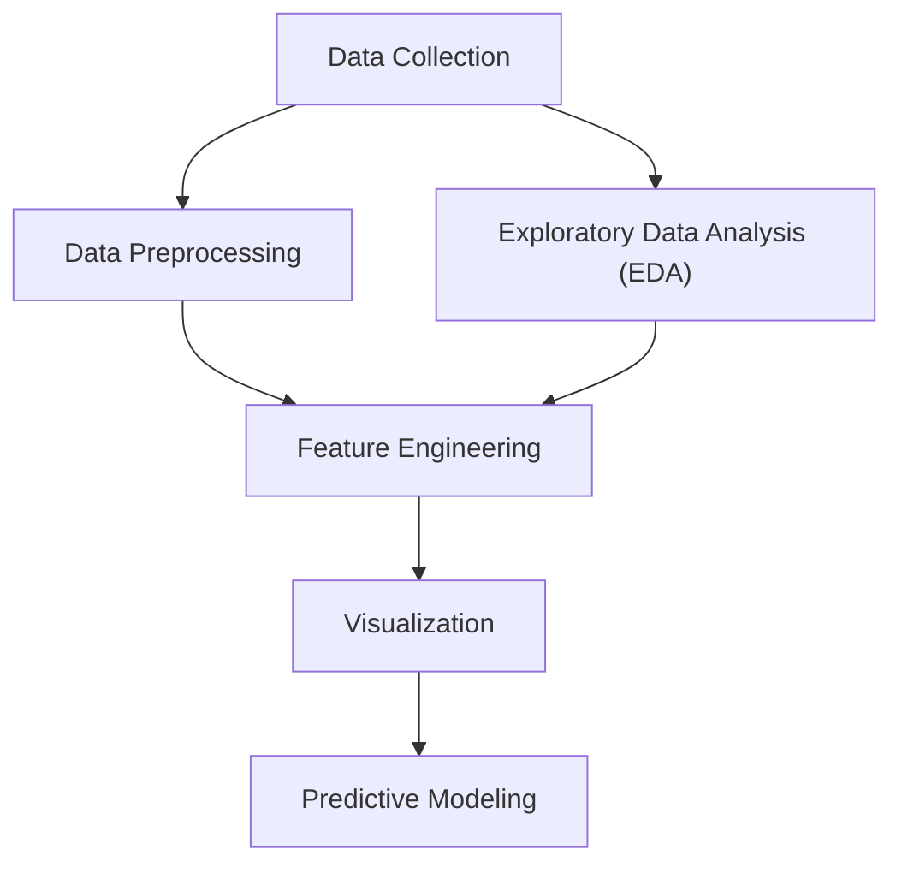

# Predicting ATM Attacks: A Data-Driven Approach

## 1. Problem Statement:
The problem revolves around predicting ATM attacks based on various geographical, demographic, and situational factors. The primary objectives include:
- Identifying influential factors contributing to ATM attacks.
- Analyzing spatial patterns and correlations to implement preventive strategies.
- Developing predictive models to anticipate potential attacks.

Various python libraries has been utilized to solve the problem statement, along with toolboxes such as WEKA and MATLAB.

## 2. Solution Approach:
Our solution approach consists of the following steps:

- **Data Collection:** Obtaining a comprehensive dataset comprising information on ATM locations, demographic characteristics, attack incidents, and geographical features.
- **Data Preprocessing:** Cleanse and preprocess the dataset to rectify errors, handle missing values, and standardize formats.
- **Exploratory Data Analysis (EDA):** Conduct exploratory analysis to understand the distribution of variables, identify correlations, and uncover insights into the data.
- **Feature selection & Engineering:** Extract relevant features and engineer new variables to enhance predictive modeling. WEKA toolbox is used to achieve this.
- **Predictive Modeling:** Build Fuzzy inference system to predict the likelihood of ATM attacks based on the available data.
- **Visualization:** Visualize spatial distributions and predictive outcomes to facilitate interpretation and decision-making. The visual insights were found using Tableau.

## 3. Visualization ( Tableau & Python) :
Visualizations play a crucial role in conveying the findings of our analysis:
- **Geographic Heatmaps:** Heatmaps depict the spatial distribution of ATM attacks, highlighting hotspots and areas of heightened risk.
- **Distance Plots:** Plots illustrating the relationship between ATM attacks and distances to highways and police stations offer insights into the influence of proximity on attack likelihood.
- **Demographic insights:** depicting demographical factor in the vicinity of ATM attack such as income, age, and unemployment etc.

## 4. Results:
Analysis of the data yielded several noteworthy results:
- **Geographical Distribution:** ATM attacks exhibit spatial clustering, with higher frequencies observed in certain regions, particularly those with closer proximity to highways and farther from police stations.
- **Attack Types:** Certain attack types, such as explosive & gas and card skimming, demonstrate higher success rates and contribute to substantial financial losses compared to other methods like card and cash trapping.
- **Rule derivation:** Machine learning models(Classification and regression tree) trained on historical data achieve promising results in predicting ATM attacks, with accuracy rates exceeding baseline levels.

## 5. Additional preventive measures
To prevent physical ATM attack different strategies must be implemented to safeguard ATMs, which have a likelihood of being attacked such as:
  - Intelligent Banknote neutralization strategy(IBNS): Sensors are placed on the box containing notes or in between the notes to cover them with ink and render them unusable, which diminishes the morale of attackers.
  - Security fog: Hinders the visibility of attackers in case of an attack.

## 6. Conclusion:
In conclusion, the research underscores the importance of data-driven approaches in addressing security challenges such as ATM attacks. By leveraging advanced analytics techniques, we have gained valuable insights into the underlying factors contributing to such incidents. Our findings not only shed light on the spatial and situational dynamics of ATM attacks but also provide a basis for developing proactive strategies to enhance security measures.
